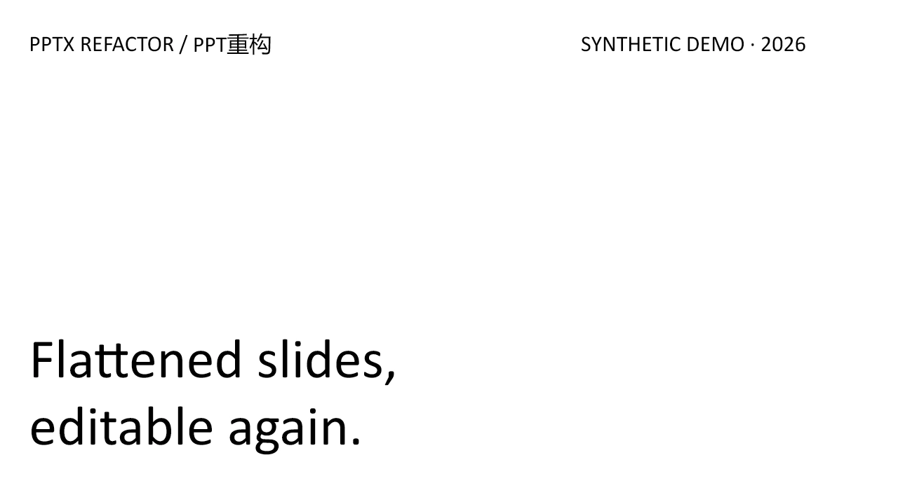

<div align="center">

# PPTX Refactor · PPT重构

**Rebuild flattened slides into faithful, maintainable PowerPoint.**<br>
**将图片型、截图型与扁平化幻灯片重构为高保真、可维护的 PowerPoint。**

[简体中文](#简体中文) · [English](#english)


[](https://github.com/isunky/pptx-refactor/actions/workflows/release.yml)
[](LICENSE)

</div>

> PPTX Refactor does not promise “fully editable” with a vague label. It reports
> text, structure, data, and raster editability separately—and records every
> exception that remains.
>
> PPTX Refactor 不用模糊的“完全可编辑”概括结果，而是分别报告文字、结构、
> 数据和位图的可编辑程度，并记录所有保留项。

## 一分钟上手 / One-minute start

1. 从 [GitHub Releases](https://github.com/isunky/pptx-refactor/releases/latest) 下载最新的 `pptx-refactor-v*.zip` 和 `.sha256`。
2. 校验文件后，将压缩包中的 `pptx-refactor` 文件夹解压到 Codex Skills 目录并重启 Codex。
3. 调用：`$pptx-refactor 把这份图片型 PPT 重构为可编辑 PPTX，并保留原有视觉风格。`

Download the latest ZIP and checksum from [GitHub Releases](https://github.com/isunky/pptx-refactor/releases/latest), extract `pptx-refactor` into the Codex Skills directory, restart Codex, then invoke `$pptx-refactor`.

---

## 简体中文

### 这是什么？

**PPTX Refactor（PPT重构）** 是一个面向 Codex 的 PowerPoint 重构 Skill。它把图片占比高、整页截图、扫描页或原生对象与位图混合的 `.pptx`，重建为视觉接近原稿、结构更清晰、后续更容易维护的演示文稿。

它不是简单地做 OCR，也不会把整页截图重新塞回 PPT。它会逐页分析内容，保留母版与版式，尽可能将文字、列表、卡片、简单图示、表格和图表恢复为 PowerPoint 原生对象；照片、Logo、产品界面和证据截图等真实性敏感内容则作为可替换图片保留。

### 核心能力

| 能力 | 说明 |
|---|---|
| 高保真重构 | 保留原文、页数、顺序、画布比例、母版、版式、主题和视觉层级 |
| 混合可编辑 | 原生重建文字与简单结构，复杂或真实性敏感视觉保留为独立图片资产 |
| 全局一致性 | 按标题、正文、列表、说明文字、卡片等语义角色统一字体、间距和组件样式 |
| 安全规划 | 每一次删除或替换都绑定到明确的源对象，不使用“删除本页全部图片”一类宽泛操作 |
| 资产可追溯 | 记录保留、提取和生成资产的来源、原因、路径与哈希 |
| 闭环 QA | 执行导入、导出、重新导入、逐页渲染、布局检查、视觉检查和哈希校验 |

### 适用范围

| 适合 | 不适合 |
|---|---|
| 图片型或整页截图型 PPTX | 从零创作一份全新的演示文稿 |
| 装入 PPTX 的扫描页、低质量截图或 AI 生成幻灯片图片 | 对已经完全可编辑的 PPT 做普通内容修改 |
| 原生标题/页脚与正文截图混合的 PPTX | 旧版 `.ppt` 或加密文件 |
| 希望保留原设计，同时提升文字和结构可编辑性的场景 | 未经确认地改写内容或重新设计整套 PPT |

### 工作流程


默认使用 **平衡模式（balanced）**：优先重建高置信度文字和简单结构，同时保留真实性敏感或难以可靠恢复的数据与视觉。

| 模式 | 侧重点 | 适用场景 |
|---|---|---|
| `balanced` | 可编辑性与视觉保真平衡 | 默认选择，适合大多数业务演示文稿 |
| `maximum-editability` | 尽可能恢复为原生对象 | 明确优先考虑深度编辑能力，并能接受轻微视觉差异 |
| `fidelity-first` | 尽量贴近原稿外观 | 视觉一致性比深度编辑更重要 |

### 合成演示案例



[查看合成案例](examples/README.md)：扁平输入由 3 张整页图片组成；可编辑输出包含 20 个原生文本框和 9 个原生形状。两者可见内容一致，但维护方式完全不同。

### 可编辑性说明

最终结果会分别报告以下四个维度，而不是笼统宣称“完全可编辑”：

| 维度 | 含义 |
|---|---|
| 文字可编辑 | 可以修改字符、段落和文本样式 |
| 结构可编辑 | 可以修改形状、连接线、布局和组合关系 |
| 数据可编辑 | 可以修改表格单元格或图表数据 |
| 位图可替换 | 可以移动、裁剪、缩放或替换图片，但图片像素本身不可编辑 |

### 安装

将仓库克隆到 Codex 的 Skills 目录，然后重新启动 Codex。

**Windows PowerShell**

```powershell
git clone https://github.com/isunky/pptx-refactor.git "$env:USERPROFILE\.codex\skills\pptx-refactor"
```

**macOS / Linux**

```bash
git clone https://github.com/isunky/pptx-refactor.git "${CODEX_HOME:-$HOME/.codex}/skills/pptx-refactor"
```

本 Skill 依赖 Codex 的 `presentations` 工作流与内置工作区运行时。无需在系统中全局安装 Node.js 或 Python 包。

也可以从 [GitHub Releases](https://github.com/isunky/pptx-refactor/releases) 下载最新的 `pptx-refactor-v*.zip`，校验随附的 SHA-256 后，将压缩包中的 `pptx-refactor` 文件夹解压到 Codex Skills 目录。

### 使用

在 Codex 中直接调用：

```text
$pptx-refactor 把这份图片型 PPT 重构为可编辑 PPTX，保留原有母版、版式和视觉风格，并列出仍然保留为图片的内容。
```

也可以指定取舍模式：

```text
$pptx-refactor 使用 maximum-editability 模式处理这份 PPTX，优先把表格、简单图表、流程图和文本恢复为原生对象。
```

### 默认交付内容

- 新文件 `<原文件名>_editable.pptx`，不会覆盖源文件
- 转换计划与对象处置记录
- 图片资产与来源清单
- 保留位图和人工复核项清单
- QA 报告、视觉问题记录和一致性摘要
- 源文件与最终文件的 SHA-256

### 重要边界

- 仅接受 `.pptx`；旧版 `.ppt` 和加密文件不在处理范围内。
- 不会在未授权的情况下改写文案或重新设计演示文稿。
- Logo、人物、照片、产品界面、证据截图和官方图示不会由生成式图像替代。
- 无法可靠确认的数字、单位、专有名词和图表数据不会被猜测，会保留为图片或标记为人工复核。
- 如果最终仍有位图内容，交付报告会明确说明其位置、原因和可编辑程度。
- PPTX 可能包含个人信息、备注、修订历史或嵌入文件；请勿将真实客户文件上传到公开 Issue，问题复现应使用合成文件。

---

## English

### What is it?

**PPTX Refactor** is a Codex Skill for reconstructing image-heavy, screenshot-based, scanned, or mixed-editability `.pptx` decks into visually faithful and maintainable PowerPoint files.

It is not a basic OCR wrapper, and it does not place a flattened screenshot back onto the slide. The workflow analyzes every slide, preserves the master and layout hierarchy, and rebuilds text, lists, cards, simple diagrams, recoverable tables, and recoverable charts as native PowerPoint objects where confidence is high. Authentic photos, logos, product interfaces, evidence screenshots, and complex illustrations remain independent, replaceable image assets.

### Highlights

| Capability | Description |
|---|---|
| Faithful reconstruction | Preserves wording, slide count, order, canvas size, masters, layouts, theme, and visual hierarchy |
| Hybrid editability | Rebuilds text and simple structure natively while retaining complex or authenticity-sensitive visuals as separate images |
| Deck-wide consistency | Normalizes typography, spacing, and repeated components by semantic role |
| Safe planning | Binds every destructive change to exact source objects instead of broad slide-wide deletion rules |
| Asset provenance | Records the source, reason, output path, and hash for retained, extracted, and generated assets |
| Closed-loop QA | Performs import/export/re-import, full-slide rendering, layout checks, visual review, and hash verification |

### Best for

| Use it for | Do not use it for |
|---|---|
| Image-only or full-slide screenshot PPTX files | Creating a new presentation from scratch |
| Scanned pages, low-quality captures, or AI-generated slide images packaged in PPTX | Routine edits to an already-editable deck |
| Mixed decks with native chrome and flattened body content | Legacy `.ppt` or encrypted files |
| Preserving an existing design while improving editability | Rewriting or redesigning a deck without explicit approval |

### Workflow

`Preflight → Analyze every slide → Validate a conversion plan → Calibrate the visual system → Rebuild native content → Round-trip and visual QA → Deliver with an exception ledger`

The default **balanced** mode rebuilds high-confidence text and simple structures while preserving visuals or data that cannot be recovered safely.

| Mode | Priority | Recommended when |
|---|---|---|
| `balanced` | Editability and visual fidelity | The default for most business decks |
| `maximum-editability` | Native reconstruction depth | Editability matters most and small visual differences are acceptable |
| `fidelity-first` | Visual fidelity | Matching the source appearance matters more than deep editability |

### Editability contract

The final handoff reports four dimensions separately instead of making a vague “fully editable” claim:

| Dimension | Meaning |
|---|---|
| Text editable | Characters, paragraphs, and text styles can be changed |
| Structure editable | Shapes, connectors, layout, and grouping can be changed |
| Data editable | Table cells or chart data can be changed |
| Raster replaceable | An image can be moved, cropped, resized, or replaced, but its pixels are not editable |

### Synthetic demo


[Explore the synthetic example](examples/README.md): the flattened input contains three full-slide images, while the editable output contains 20 native text boxes and nine native shapes. The visible content is equivalent; the maintenance model is not.

### Installation

Clone the repository into the Codex Skills directory, then restart Codex.

**Windows PowerShell**

```powershell
git clone https://github.com/isunky/pptx-refactor.git "$env:USERPROFILE\.codex\skills\pptx-refactor"
```

**macOS / Linux**

```bash
git clone https://github.com/isunky/pptx-refactor.git "${CODEX_HOME:-$HOME/.codex}/skills/pptx-refactor"
```

The Skill uses the Codex `presentations` workflow and bundled workspace runtime. No global Node.js or Python package installation is required.

Alternatively, download the latest `pptx-refactor-v*.zip` from [GitHub Releases](https://github.com/isunky/pptx-refactor/releases), verify it against the accompanying SHA-256 file, and extract the contained `pptx-refactor` folder into your Codex Skills directory.

### Usage

Invoke the Skill directly in Codex:

```text
$pptx-refactor Rebuild this image-heavy deck as an editable PPTX. Preserve its master, layouts, wording, and visual style, and report every element that remains raster-based.
```

You can also choose a trade-off mode:

```text
$pptx-refactor Process this deck in maximum-editability mode. Prioritize native text, tables, simple charts, process diagrams, and reusable shapes.
```

### Default deliverables

- A new `<source>_editable.pptx`; the source file is never overwritten
- A validated conversion plan and object disposition record
- An asset and provenance manifest
- Retained-raster and manual-review exception ledgers
- QA reports, visual issue evidence, and consistency summaries
- Source and final SHA-256 values

### Important boundaries

- Only `.pptx` is accepted; legacy `.ppt` and encrypted files are unsupported.
- Content is not rewritten and the deck is not redesigned without explicit approval.
- Logos, people, photos, product UI, evidence screenshots, and official diagrams are never replaced with generated substitutes.
- Uncertain numbers, units, proper nouns, and chart data are never guessed; they remain raster-based or are marked for manual review.
- Any retained raster content is disclosed with its location, reason, and editability level.
- PPTX files may contain personal data, notes, revision history, or embedded files. Never upload customer decks to public issues; use synthetic reproductions.

---

## Repository structure

```text
pptx-refactor/
├── SKILL.md          # Skill workflow and operating contract
├── agents/           # Codex display metadata and default prompt
├── references/       # Decision rules, schemas, compatibility, and QA guidance
└── scripts/          # Analysis, plan validation, asset preparation, and QA tools
```

The detailed operating contract lives in [`SKILL.md`](SKILL.md). Supporting references are loaded only when their decision path applies.

## Maintenance

Keep paths inside the Skill relative and portable. Before publishing changes, validate the Skill metadata, run syntax checks for the bundled scripts, and inspect the resulting Git diff.

Pushing a semantic-version tag such as `v0.2.0`, or running **Release Skill** manually from GitHub Actions, validates the Skill and publishes a ZIP plus its SHA-256 checksum to GitHub Releases.

Run the repository checks locally with:

```bash
node scripts/validate_skill_bundle.mjs
node --test tests/*.test.mjs
```

Contributions are welcome under the [contribution guide](CONTRIBUTING.md). Security-sensitive reports should follow the [security policy](SECURITY.md). Released code is available under the [MIT License](LICENSE).
